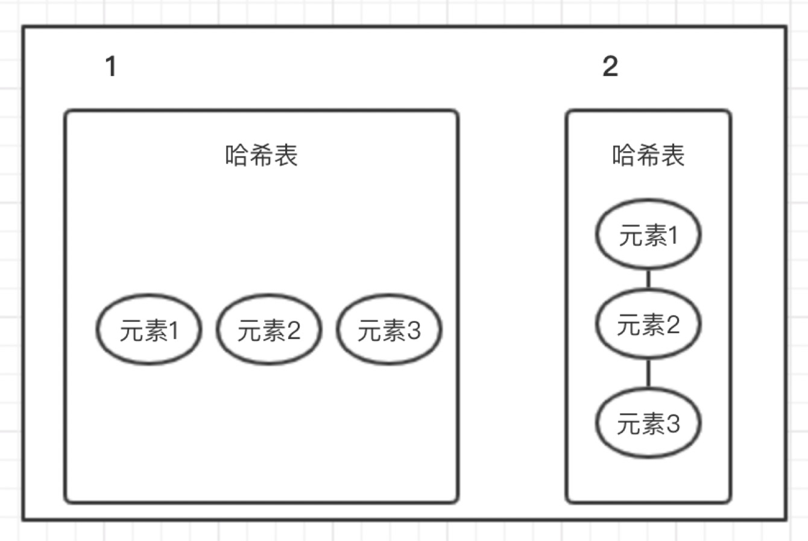

# 1.List

>  **有序、可存放重复值**

## 1.1.ArrayList

### 1.1.1.概述

_@since 1.2_

> 1. 底层是object类型的数组
> 2. 可以有重复项
> 3. 可以存null值
> 4. 元素有序
> 5. 线程不安全 `Collections.synchronizedList(new ArrayList(...))`
> 6. 默认的capacity值为10 `private static final int DEFAULT_CAPACITY = 10;`
> 7. 当从 ArrayList 的中间位置插入或者删除元素时，需要对数组进行复制、移动、代价比较高。因此，它适合随机查找和遍历，不适合插入和删除


```java
/**
  * The maximum size of array to allocate.
  * Some VMs reserve some header words in an array.
  * Attempts to allocate larger arrays may result in
  * OutOfMemoryError: Requested array size exceeds VM limit
  */
private static final int MAX_ARRAY_SIZE = Integer.MAX_VALUE - 8;

/**
  * Increases the capacity to ensure that it can hold at least the
  * number of elements specified by the minimum capacity argument.
  * @param minCapacity the desired minimum capacity
  */
private void grow(int minCapacity) {

    // overflow-conscious code
    int oldCapacity = elementData.length;

    // capacity 是呈1.5倍上涨的
    // 初始值10 第一次扩容是15 第二次扩容是22(舍去0.5取整)
    int newCapacity = oldCapacity + (oldCapacity >> 1);
    if (newCapacity - minCapacity < 0)
        newCapacity = minCapacity;
    if (newCapacity - MAX_ARRAY_SIZE > 0)
        newCapacity = hugeCapacity(minCapacity);

    // minCapacity is usually close to size, so this is a win:
    // 当数组大小不满足时需要增加存储能力，
    // 就要将已经有数组的数据复制到新的存储空间中
    elementData = Arrays.copyOf(elementData, newCapacity);
}

// 该源码可以看出 capacity 最大值就是 Integer.MAX_VALUE
// ★★★★★ 生产实践：如果要存储一个大的数据集 最好是初始化大小 因为扩容的性能非常差

private static int hugeCapacity(int minCapacity) {
    if (minCapacity < 0) // overflow
        throw new OutOfMemoryError();
    return (minCapacity > MAX_ARRAY_SIZE) ?
    Integer.MAX_VALUE :
    MAX_ARRAY_SIZE;
}
```

### 1.1.2.ArrayList线程不安全及解决方案

#### 1.1.2.1.线程不安全现象案例

```java
/**
 * @ClassName ArrayListNoSafeApp
 * @Description ArrayList 线程不安全 案例
 *
 * 线程不安全现象 java.util.ConcurrentModificationException
 *
 * @Author cll
 * @Date 2018/2/1 9:30 下午
 * @Version 1.0
 **/
public class ArrayListNoSafeApp {

    public static void main(String[] args) {
        /*
         * 线程不安全
         * 会出现 java.util.ConcurrentModificationException 异常
         */
        final List<String> list = new ArrayList<String>();

        for (int i = 1; i <= 10; i++) {
            new Thread(new Runnable() {
                public void run() {
                    list.add(UUID.randomUUID().toString().substring(0,4));
                    System.out.println(list);
                }
            },String.valueOf(i)).start();
        }
    }
}
```

以上代码运行会出现：`java.util.ConcurrentModificationException` 异常

#### 1.1.2.2.解决方案

##### 1.1.2.2.1.方案一

```java
/*
 * @since JDK1.0
 * 方法上添加 synchronized 实现线程安全
 * 效率低
*/
final List<String> list = new Vector<String>();
```

##### 1.1.2.2.2.方案二

```java
/*
 * @since 1.2
 * 通过 synchronized() {} synchronized代码块实现线程安全
 */
final List<String> list = Collections.synchronizedList(new ArrayList<String>());
```

##### 1.1.2.2.3.方案三

```java
/*
 * @since 1.5
 * 使用 ReentrantLock 加锁实现的线程安全 读写分离的思想
 * 实现思路：
 *    写时复制，往容器添加元素的时候，不直接往当前容器Object[]添加，
 * 而是先将当前容器Object[]进行copy，复制出一个新的容器Object[] newElements，
 * 然后往新的容器Object[] newElements里添加元素，添加完成之后，
 * 再将原容器的引用指向新的容器setArray(newElements) 保证了对容器的并发读操作
 * 读写分离的思想 读和写是不同的容器
 */
final List<String> list = new CopyOnWriteArrayList<String>();
```


* 面试题：

1. new ArrayList() 数组的size是多少？ 0 是一个空的数组

> `new Array() { this.elementData = DEFAULTCAPACITY_EMPTY_ELEMENTDATA}`

2. 下面程序执行结果

```java
List<String> list = new ArrayList<String>();
list.add("a");
list.add("b");
list.add("b");
list.add("b");
list.add("c");
for(int i = 0; i < list.size(); i++){
    if(list.get(i).equals("b")){
        list.remove(i);
    }
}
for(int i = 0; i < list.size(); i++){
    System.out.println(list.get(i));
}
System.out.println(list.size());

// 答案
遍历的结果是   会发现没有删除完
a
b
c
打印的list.size()  是 3

// 上面遗留问题就是指定的元素没有删除完  怎么解决？  方法如下
List<String> list = new ArrayList<String>();
list.add("a");
list.add("b");
list.add("b");
list.add("b");
list.add("c");

for(int i = list.size()-1; i > 0; i--){
    if(list.get(i).equals("b")){
        list.remove(i);
    }
}

for(int i = 0; i < list.size(); i++){
    System.out.println(list.get(i));
}

System.out.println(list.size());
```


## 1.2.LinkedList

_@since 1.2_

> 1. 链表结构存储数据，适合数据的动态插入和删除操作
> 2. 随机访问和遍历速度比较慢
> 3. 除了实现list接口中的方法外，还定义了操作表头表尾元素的方法，可以把该集合当作堆栈、队列和双向队列使用

# 2.set

> 1. 存放的元素无序(存入和取出的顺序不一定相同)
> 2. 元素不可重复

## 2.1.HashSet

### 2.1.1.概述

> 1. 哈希表存放的是哈希值
> 2. 存储的元素的顺序不是按照存入的顺序，而是按照哈希值存储的，所以取数据也是按照哈希值取
> 3. 存入数据时，会先判断两个元素的哈希值，如果哈希值相同，接着会比较equals方法，如果为tru，视为同一个元素，如果不同就是不同元素
> 4. 哈希值相同，equals为false如何存储的，就是在同样的哈希值下顺延，也就是哈希值相同的元素放在一个哈希桶中，如下图所示，图1是哈希值不同的情况，图2是哈希值相同但equals不同的情况
> 5. HashSet是通过hashCode值来确定元素在内存中的位置，一个hashCode位置上可以存放多个元素



### 2.1.2.源码分析

> 1. `HashSet` 底层是一个 `HashMap``
> 2. `HashMap` 的key存放的就是存入 `HashSet` 的元素，value是一个常量

```java
public class HashSet<E>
    extends AbstractSet<E>
    implements Set<E>, Cloneable, java.io.Serializable
{
   // Dummy value to associate with an Object in the backing Map
    private static final Object PRESENT = new Object();
   /**
     * new HashSet()
     */
    public HashSet() {
        map = new HashMap<>();
    }
    // 添加元素
    public boolean add(E e) {
        return map.put(e, PRESENT)==null;
    }
}
```

### 2.1.3.线程不安全案例及解决方案

```java
/**
 * @ClassName HashSetNoSafeApp
 * @Description HashSet 线程不安全 案例
 *
 * 线程不安全现象
 *   java.util.ConcurrentModificationException
 *
 * @Author cll
 * @Date 2018/2/1 10:44 下午
 * @Version 1.0
 **/
public class HashSetNoSafeApp {
    public static void main(String[] args) {
        final Set<String> set = new HashSet<String>();
        for (int i = 1; i <= 10; i++) {
            new Thread(new Runnable() {
                public void run() {    set.add(UUID.randomUUID().toString().substring(0,4));
                    System.out.println(set);
                }
            },String.valueOf(i)).start();
        }
    }
}
```

#### 2.1.3.1.方案一

```java
final Set<String> set = Collections.synchronizedSet(new HashSet<String>());
```

#### 2.1.3.2.方案二

```java
/*
 * 同ArrayList 详情见ArrayList
 */
final Set<String> set = new CopyOnWriteArraySet<String>();
```

## 2.2.TreeSet

> 1. 使用二叉树的原理对新add()的对象按照指定的顺序排序(升序、降序)，每增加一个对象都会进行排序，将对象插入二叉树指定的位置
> 2. Integer和String对象可以进行默认的TreeSet排序，而自定义类的对象是不可以的，需要实现Comparable接口，并且覆写相应的compareTo()函数，才可以正常使用
> 3. 在覆写compare函数时，要返回相应的值参能使TreeSet按照一定的规则来排序

## 2.3.LinkedHashSet

> 1. HashSet + LinkedHashMap
> 2. 继承HashSet、又基于LinkedHashMap实现
> 3. 操作与HashSet相同

# 3.Map

## 3.1.HashMap

_@since 1.2_

### 3.1.1.概述

> 1. 键值对，键存储的是键的hashCode值，可以快速定位，访问速度快
> 2. 遍历的顺序不确定
> 3. 允许一条键为null的记录，允许多条值为Null的记录
> 4. 线程不安全 可以通过该种方式解决线程不安全的问题：`Map<String, String> map = Collections.synchronizedMap(new HashMap<String, String>());`，也可以使用`ConcurrentHashMap`替换`HashMap`以达到线程安全
> 5. 初始化的capacity `static final int DEFAULT_INITIAL_CAPACITY = 1 << 4; // aka 16`，始终保持2的倍数扩容
> 6. 最大的capacity值 `static final int MAXIMUM_CAPACITY = 1 << 30;`
> 7. 默认的`load_factor`(负载因子) `static final float DEFAULT_LOAD_FACTOR = 0.75f;`
> 8. `threhold` 扩容阀值=`capacity * load_factor`

### 3.1.2.Java7/Java8改进

> 1. Java8对HashMap进行了一些修改，利用了红黑树
> 2. Java7查找的时候，根据hash值快速定位数组的索引，然后顺着链表一个个比较直到找到对应的元素，该时间复杂度取决于链表的长度，也就是O(n)
> 3. Java8中，当链表中的元素超过了8个以后，会将链表转换为红黑树，这样就可以将时间复杂度降低为O(logN)

### 3.1.3.线程不安全现象及解决方案

```java
/**
 * @ClassName HashMapNoSafeApp
 * @Description HashMap 线程不安全 解决方案
 *
 * 线程不安全现象
 *   java.util.ConcurrentModificationException
 *
 * @Author cll
 * @Date 2018/2/2 10:54 下午
 * @Version 1.0
 **/
public class HashMapNoSafeApp {
    public static void main(String[] args) {
        final Map<String, String> map = new HashMap<String, String>();

        for (int i = 1; i <= 100; i++) {
            new Thread(new Runnable() {
                public void run() {
                    map.put(Thread.currentThread().getName(),UUID.randomUUID().toString().substring(0,4));
                    System.out.println(map);
                }
            },String.valueOf(i)).start();
        }
    }
}
```


#### 3.1.3.1.解决方案一

```java
// 使用 Collections 工具类
final Map<String, String> map = Collections.synchronizedMap(new HashMap<String, String>());
```


#### 3.1.3.2.解决方案二

```java
// @since 1.5 参考 3.2章节
final Map<String, String> map = new ConcurrentHashMap<String, String>();
```

## 3.2.ConcurrentHashMap

_@since 1.5_

### 3.2.1.简述

实现思路跟`HashMap`差不多，支持并发操作；整个`ConcurrentHashMap`是由一个个`Segment`(部分/一段)组成，所以也有成为分段锁的

### 3.2.2.线程安全

`ConcurrentHashMap`是一个`Segment`数组，`Segment`通过继承`ReentrantLock`来进行加锁，所以每次需要加锁的操作也就是操作锁住一个`Segment`，这样只要保证每个`Segment`是线程安全的，也就实现了全局的线程安全

**DEFAULT_CONCURRENCY_LEVEL**

`concurrency_level`，默认为16，也就是16个`Segment`，所以可以同时支持16个线程并发写，前提是16个线程的操作分布在不同的`Segment`上；该值初始化的时候可以设置，一旦初始化过后，就不可以进行扩容

### 3.2.3.Java7/Java8改进

引入红黑树

## 3.3.HashTable

`HashMap`的前身，功能类似`HashMap`，继承自`Dictionary`类，线程安全，但是并发性不如`ConcurrentHashMap`

## 3.4.TreeMap

可排序，实现了`SortedMap`接口，把保存的记录根据键排序，默认升序；也可以指定比较器进行排序

在使用`TreeMap`时，key必须实现 `Comparable`接口，或者构造`TreeMap`的时候传入自定义的 `Comparator`，否则抛出 `ClassCastException`

## 3.5.LinkedHashMap

是`HashMap`的子类，保存了记录的插入的顺序