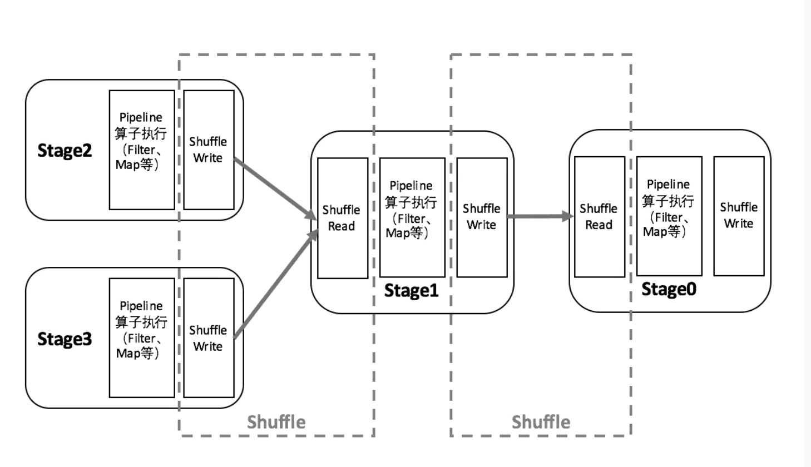
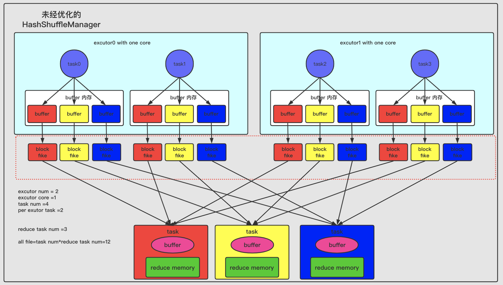
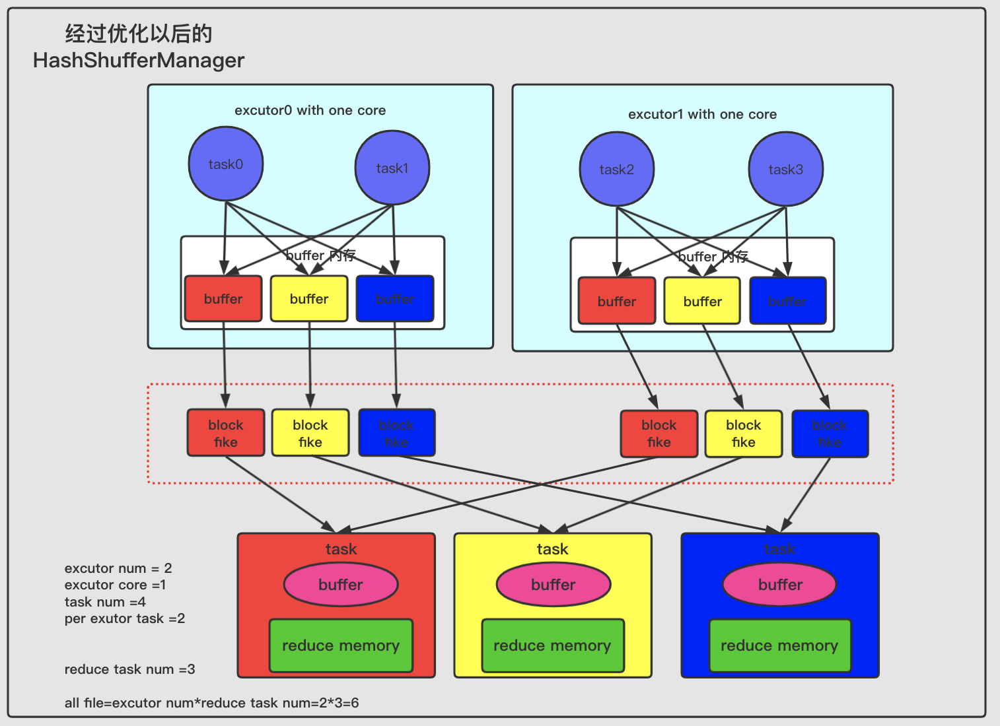
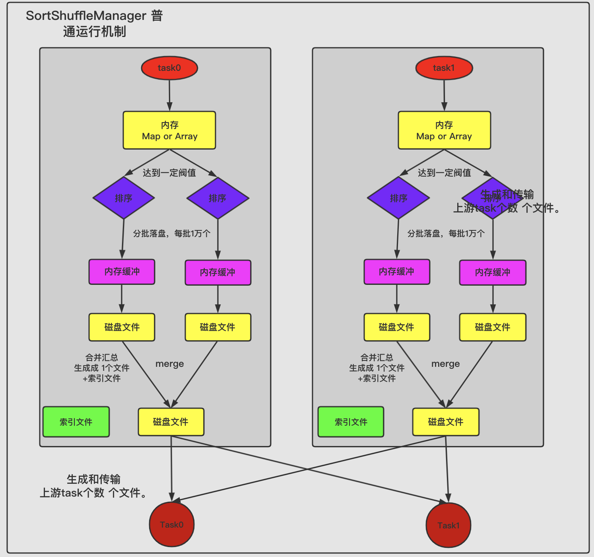
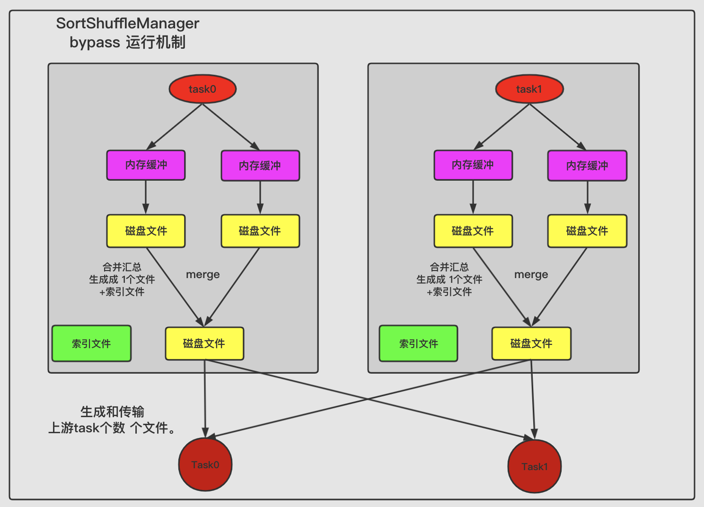
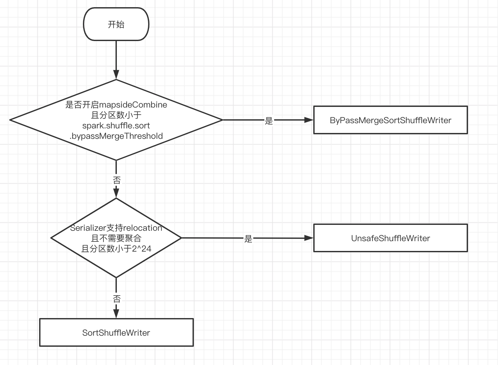
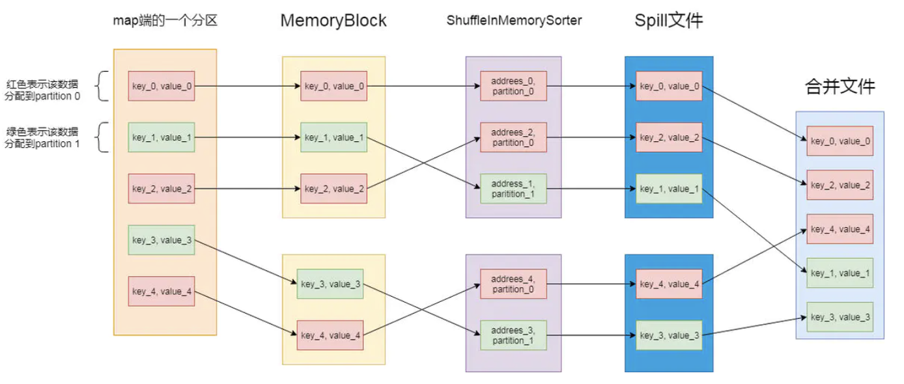

## 1.Shuffle 实现的演进

### 1.1.依赖

在理解shuffle之前先理解下RDD依赖关系，分为宽依赖、窄依赖

1. **窄依赖** 

   一个父`RDD`的 `partition` 至多被子 `RDD` 的 `partition` 使用一次  

   都在一个`stage`完成的

   例如：filter、map、flatMap、sample、union、mapPartitions等算子操作

2. **宽依赖**

   一个父`RDD`的 `partition` 会被子 `RDD` 的 `partition` 使用多次

   会产生`shuffle` 会有新的`stage`

   例如：sortBy、sortByKey、reduceByKey、join、leftOuterJoin、rightOuterJoin、repartition等算子操作

所以综上，宽依赖才会产生shuffle，不过生产大部分都是宽依赖操作

### 1.2.概述

大多数 spark 作业的性能主要就是消耗 shuffle 过程，因为该环节涉及了**大量磁盘IO、序列化、网络数据传输**等操作。但是实际上，影响 Spark 作业性能的因素：代码开发、资源参数以及数据倾斜，shuffle 调优只能在整个 Spark 作业性能调优中占比较小的一部分。



从上图可以看出，以shuffle为边界，spark将一个job划分为不同的stage，这些stage构成了一个大粒度的DAG；spark shuffle分为write和read两个部分，分别属于两个不同的stage；

执行shuffle的主体是stage中的并发任务，这些任务分为ShuffleMapTask和ResultTask两种，前者要进行shuffle，后者负责返回计算结果，一个job中只有最后的stage采用ResultTask，其他的都是ShuffleMapTask；按照map端和reduce端分析的话，ShuffleMapTask既是map端任务，也是reduce端任务，因为Spark中的shuffle是可以串行的，而ResultTask只能是reduce端任务

### 1.3.两种机制

在 Spark1.2 之前，默认的 shuffle 计算引擎时 HashShuffleManager，该机制会产生大量的中间磁盘文件进而影响性能；在 Spark1.2 版本之后，默认的 ShuffleManager 改成了 SortShuffleManager，相较于 HashShuffleManager 有了一定改进，主要就是对产生的临时磁盘文件在最后做个合并，形成一个磁盘文件，所以每个 task 只有一个磁盘文件，同时会生成一个索引文件，在下一个 stage 的 shuffle read task 拉取自己的数据时，只要根据索引读取每个磁盘文件中的部分数据即可。

对以上两种 ShuffleManager 又可以详细划分出四种策略

* Spark1.2版本以前 HashShuffle
  * 未经优化的 HashShuffle
  * 优化过后的 HashShuffle
* Spark1.2版本之后 Sort-Based Shuffle
  * 普通机制
  * ByPass 机制

#### 1.3.1.HashShuffle(弃用)

**Spark2.0.0版本之后，移除了该 shuffle 机制**

##### 1.3.1.1.未优化的 HashShuffle

**图示**



**说明**

对于相同的 key 执行 hash 算法，从而将相同的 key 都写入到一个磁盘文件中，而每一个磁盘文件都只属于下游 stage 的一个 task；在将数据写入磁盘之前，会先将数据写入到内存缓冲，当内存缓冲填满之后，才会溢写到磁盘文件中。

该机制存在一个很大的问题，下游有几个 task ，上游的每个 task 就需要创建几个临时文件，每个文件中只存储 key 取 hash 之后相同的数据，导致了当下游的 task 任务过多的时候，上游会堆积大量的小文件。

**案例**

```bash
# 有两个 executor 分别是 executor0  executor1，且每个executor都只有1core
executor num = 2
executor core = 1
# 现在每个executor运行两个task，分别是 task0+task1   task2+task3
task num = 4
task per executor = 2
# 有 3 个reduce task
reduce task num = 3

# 最终产生的文件就是 
task num * reduce task num = 4 * 3 = 12
```

实际生产中 task num 和 reduce task num 的数据是远远大于案例中的数，可想而知小文件的量之大！！！

##### 1.3.1.2.优化后的 HashShuffle

**图示**



**说明**

在 shuffle write 过程中，task 就不是为下游 stage 的每个 task 创建一个磁盘文件了，此时出现了 **shuffleFileGroup** 的概念，每个 shuffleFileGroup 会对应一批磁盘文件，磁盘文件的数量与下游 stage 的 task 数量是相同的。当第一批并行执行的每个 task 都会创建一个 shuffleFileGroup ，并将数据写入对应的磁盘文件内，当第一批执行完毕接着执行下一批task时，会复用当前 executor 已有的 shuffleFileGroup，并将数据写入已有的磁盘文件中，而不会写入新的磁盘文件。

所以 consolidate 机制允许不同的 task 复用同一批磁盘文件，可以有效的将多个 task 磁盘文件进行一定程度上的合并，从而大幅减少磁盘文件数量，提供 shuffle write 性能。

```bash
# 开启该机制的方式是配置参数   该参数在 < spark1.6 的版本中生效
spark.shuffle.consolidateFiles=true 
```

**案例**

```bash
# 有两个 executor 分别是 executor0  executor1，且每个executor都只有1core
executor num = 2
executor core = 1
# 现在每个executor运行两个task，分别是 task0+task1   task2+task3
task num = 4
task per executor = 2
# 有 3 个reduce task
reduce task num = 3

# 最终产生的文件就是 
executor num * reduce task num = 2 * 3 = 6
```

相较于未开启 consolidate 机制已经大幅减少了文件数！！！

但是在实际应用中，CPU 核数会很多，而且 reduce 任务数也很多，所以中间生成的文件仍然很多


#### 1.3.2.SortShuffle

_SortShuffle在Spark1.1引入_

该机制每个 `ShuffleMapTask`都只创建一个文件，将所有的 `ShuffleReduceTask` 的输入写入同一个文件，并且对应生成一个索引文件

以前的数据是放在内存缓存中，等到数据完了再刷到磁盘，现在为了减少内存的使用，在内存不够用的时候，可以将输出溢写到磁盘，结束的时候，再将这些不同的文件联合内存的数据一起进行归并，从而减少内存的使用量。一方面文件数量显著减少，另一方面减少Writer 缓存所占用的内存大小，而且同时避免 GC 的风险和频率

但是对于 reduce 数比较少的情况，Hash Shuffle 要比 Sort Shuffle 快，所以之后推出了 ByPass 机制，对应 reduce 数少于 `spark.shuffle.sort.bypassMergeThreshold` (默认值200)，将启用 ByPass 机制

##### 1.3.2.1.普通机制

**图示**



**说明**

数据会先写入一个内存数据结构中，该数据结构会根据 shuffle 算子的不同而不同。如果是聚合操作的 shuffle 算子，就用map的数据结构(边聚合边写入内存)，如果是 join 的算子，就使用array的数据结构(直接写入内存)。没写入一条数据进入内存数据结构之后，就会判断是否达到了某个临界值，如果到达了，就会尝试将内存数据结构中的数据溢写到磁盘，然后情况内存数据结构。

在溢写磁盘文件之前，会先根据key对内存数据结构中已有的数据进行排序，排序之后，会分批将数据写入磁盘文件。默认的batch数量是10000条，写入磁盘文件时通过java的 BufferedOutputStream 实现，它是java的缓冲输出流，会将数据缓冲在内存中，当内存缓冲满溢之后再一次写入磁盘文件，可以减少磁盘IO次数，提升性能。

以上的多次溢写磁盘，会产生多个临时文件，最后会将之前所有的临时文件都进行合并，最后只剩下两个文件，一个是合并之后的数据文件，一个是索引文件（该文件标识了下游各个task的数据在文件中start offset和end offset）。

##### 1.3.2.2.ByPass 机制

**图示**



**说明**

此时task会为每个下游task都创建一个临时磁盘文件，并将数据按key进行hash然后根据key的hash值，将key写入对应的磁盘文件之中。当然，写入磁盘文件时也是先写入内存缓冲，缓冲写满之后再溢写到磁盘文件的。最后，同样会将所有临时磁盘文件都合并成一个磁盘文件，并创建一个单独的索引文件。

该机制与普通SortShuffleManager运行机制的不同在于：

1. 磁盘写机制不同
2. 不会进行排序

所以，启用该机制的最大好处在于，shuffle write 过程中，不需要进行数据的排序操作，也就节省了这部分的性能开销

## 2.SortShuffle

spark2.0之后的版本，Hash Shuffle 已经退出

Shuffle 的生命周期是由 ShuffleManager 管理，在 ShuffleManager 中定义了 writer 和 reader 对应了 Shuffle 的 map 和 reduce 阶段，reader 只有一种实现：`BlockStoreShuffleReader`，而 writer 有三种实现：

1. `ByPassMergeSortShuffleWriter`：当前 Shuffle 没有聚合，且分区数小于 `spark.shuffle.sort.bypassMergeThreshold`
2. `UnsafeShuffleWriter`：条件不满足 `ByPassMergeSortShuffleWriter` 且 当前 RDD 的数据支持序列化(`UnsafeRowSerializer`)，也不需要聚合，分区数小于 2^24
3. `SortShuffleWriter`：以上条件都不满足的情况下



### 2.1.BypassMergeSortShuffleWriter

**该机制触发条件**

1. shuffle reduce task的数量小于 `spark.shuffle.sort.bypassMergeThreshold` 参数的值（默认200）
2. 没有map side aggregations，是指map端聚合操作，通常来说一些聚合类的算子都会都 map 端的 aggregation。不过对于 `groupByKey` 和`combineByKey`， 如果设定 `mapSideCombine` 为false，就不会有 map side aggregations

```scala
// We cannot bypass sorting if we need to do map-side aggregation.
if (dep.mapSideCombine) {
  require(dep.aggregator.isDefined, "Map-side combine without Aggregator specified!")
  false
} else {
  val bypassMergeThreshold: Int = conf.getInt("spark.shuffle.sort.bypassMergeThreshold", 200)
  dep.partitioner.numPartitions <= bypassMergeThreshold
}
```


`BypassMergeSortShuffle` 适用于没有聚合，数据量不大的场景

**BypassMergeSortShuffleWriter 所有的中间数据都在磁盘，并没有利用内存，而且只保证分区索引是排序的，并不保证数据的排序**

该过程的磁盘写机制跟未经优化的 `HashShuffleManager` 是一样的，也会创建很多临时文件(因此触发条件会有 reduce task 数量的限制)，只是最后会做一个磁盘文件合并，合并这个操作对于 shuffle reader 更友好点

**BypassMergeSortShuffleWriter 与 HashShuffleWriter 的区别 ? **

### 2.2.SortShuffleWriter

可以先考虑一个问题，假如有 100 亿条数据，内存只有 1M，但是磁盘很大，现在要对这 100 亿条数据进行排序，是没法把所有的数据一次性的 load 进行内存进行排序的，这就涉及到一个**外部排序**的问题。

假设 1M 内存能装进 1 亿条数据，每次能对这 1 亿条数据进行排序，排好序后输出到磁盘，总共输出 100 个文件，最后把这 100 个文件进行 merge 成一个全局有序的大文件，这是归并的思路：

可以每个文件（有序的）都取一部分头部数据最为一个 buffer， 并且把这 100个 buffer 放在一个堆里面，进行堆排序，比较方式就是对所有堆元素（buffer）的head 元素进行比较大小， 然后不断的把每个堆顶的 buffer 的head 元素 pop 出来输出到最终文件中， 然后继续堆排序，继续输出。如果哪个 buffer 空了，就去对应的文件中继续补充一部分数据。最终就得到一个全局有序的大文件。

SortShuffleWirter  的实现大概就是这样，和 Hadoop MR 的实现相似


**BypassMergeSortShuffleWriter 与该机制相比：**

1. 磁盘写机制不同

2. 不会进行排序

   也就是说，启用 BypassMerge 机制的最大好处在于，shuffle write 过程中，不需要进行数据的排序操作，也就节省掉了这部分的性能开销，当然需要满足那两个触发条件。

### 2.3.UnsafeShuffleWriter

**触发条件**

1. Serializer 支持 relocation。Serializer 支持 relocation 是指，Serializer 可以对已经序列化的对象进行排序，这种排序起到的效果和先对数据排序再序列化一致。支持 relocation 的 Serializer 是 KryoSerializer，Spark 默认使用 JavaSerializer，通过参数 spark.serializer 设置
2. 没有指定 aggregation 或者 key 排序， 因为 key 没有编码到排序指针中，所以只有 partition 级别的排序
3. partition 数量不能大于指定的阈值(2^24)，因为 partition number 使用24bit 表示的。

`UnsafeShuffleWriter` 首先将数据序列化，保存在 `MemoryBlock` 中。然后将该数据的地址和对应的分区索引，保存在 `ShuffleInMemorySorter` 内存中，利用`ShuffleInMemorySorter` 根据分区排序。当内存不足时，会触发 spill 操作，生成spill 文件。最后会将所有的 spill文 件合并在同一个文件里。过程如下图：



`UnsafeShuffleWriter` 是对 `SortShuffleWriter` 的优化，大体差不多，主要有以下区别：

1. 在 `SortShuffleWriter` 的 `PartitionedAppendOnlyMap` 或者 `PartitionedPairBuffer` 中，存储的是键值或者值的具体类型，也就是 Java 对象，是**反序列化**过后的数据。而在 `UnsafeShuffleWriter` 的 `ShuffleExternalSorter `中数据是**序列化**以后存储到实际的 Page 中，而且在写入数据过程中会额外写入长度信息。总体而言，序列化以后数据大小是远远小于序列化之前的数据
2. `UnsafeShuffleWriter` 中需要额外的存储记录（LongArray），它保存着分区信息和实际指向序列化后数据的指针（经过编码的Page num 以及 Offset）。相对于 `SortShuffleWriter`， `UnsafeShuffleWriter` 中这部分存储的开销是额外的

## 3.Spark Shuffle 中的数据结构 

`SortShuffleWriter` 中使用 `ExternalSorter` 来对内存中的数据进行排序，`ExternalSorter` 中缓存记录数据的数据结构有两种：

1. **Buffer**，对应的实现类`PartitionedPairBuffer`，设置**mapSideCombine=false** 时会使用该结构
2. **Map**，对应的实现类是`PartitionedAppendOnlyMap`，设置**mapSideCombine=true**时会使用该结构

两者都是使用了 hash table 数据结构， 如果需要进行 aggregation， 就使用 `PartitionedAppendOnlyMap`（支持 lookup 某个Key，如果之前存储过相同 key 的 K-V 元素，就需要进行 aggregation，然后再存入aggregation 后的 K-V）， 否则使用 `PartitionedPairBuffer`（只进行添K-V 元素） 

### shuffle 调优参数

主要是调整缓冲的大小，拉取次数重试重试次数与等待时间，内存比例分配，是否进行排序操作等等

**spark.shuffle.file.buffer**

* 参数说明：该参数用于设置shuffle write task的BufferedOutputStream的buffer缓冲大小（默认是32K）。将数据写到磁盘文件之前，会先写入buffer缓冲中，待缓冲写满之后，才会溢写到磁盘。
* 调优建议：如果作业可用的内存资源较为充足的话，可以适当增加这个参数的大小（比如64k），从而减少shuffle write过程中溢写磁盘文件的次数，也就可以减少磁盘IO次数，进而提升性能。在实践中发现，合理调节该参数，性能会有1%~5%的提升。

**spark.reducer.maxSizeInFlight**

* 参数说明：该参数用于设置shuffle read task的buffer缓冲大小（默认48m），而这个buffer缓冲决定了每次能够拉取多少数据。
* 调优建议：如果作业可用的内存资源较为充足的话，可以适当增加这个参数的大小（比如96m），从而减少拉取数据的次数，也就可以减少网络传输的次数，进而提升性能。在实践中发现，合理调节该参数，性能会有1%~5%的提升。

**spark.shuffle.io.maxRetries 和 spark.shuffle.io.retryWait**

* spark.shuffle.io.retryWait：huffle read task从shuffle write task所在节点拉取属于自己的数据时，如果因为网络异常导致拉取失败，是会自动进行重试的。该参数就代表了可以重试的最大次数。（默认是3次）
* spark.shuffle.io.retryWait：该参数代表了每次重试拉取数据的等待间隔。（默认为5s）
* 调优建议：一般的调优都是将重试次数调高，不调整时间间隔。

**spark.shuffle.memoryFraction**

* 参数说明：该参数代表了Executor内存中，分配给shuffle read task进行聚合操作的内存比例（默认0.2）。

**spark.shuffle.manager**

* 参数说明：该参数用于设置shufflemanager的类型（默认为sort）。Spark1.5x以后有三个可选项：

  ```bash
  Hash：spark1.x版本的默认值，HashShuffleManager
  Sort：spark1.6.x版本的默认值，普通机制，当shuffle read task 的数量小于等于spark.shuffle.sort.bypassMergeThreshold参数，自动开启bypass 机制
  tungsten-sort
  ```


**spark.shuffle.sort.bypassMergeThreshold**

* 参数说明：当ShuffleManager为SortShuffleManager时，如果shuffle read task的数量小于这个阈值（默认是200），则shuffle write过程中不会进行排序操作。
* 调优建议：当你使用SortShuffleManager时，如果的确不需要排序操作，那么建议将这个参数调大一些

**spark.shuffle.consolidateFiles**

* 参数说明：如果使用HashShuffleManager，该参数有效。如果设置为true，那么就会开启consolidate机制，也就是开启优化后的HashShuffleManager。
* 调优建议：如果的确不需要SortShuffleManager的排序机制，那么除了使用bypass机制，还可以尝试将spark.shffle.manager参数手动指定为hash，使用HashShuffleManager，同时开启consolidate机制。在实践中尝试过，发现其性能比开启了bypass机制的SortShuffleManager要高出10%~30%。

## 4.源码分析

_基于Spark1.6_

从 executor 启动 task 入口开始

`org.apache.spark.executor.CoarseGrainedExecutorBackend`

```scala
override def receive: PartialFunction[Any, Unit] = {
  // TODO ...
  // 启动任务
  case LaunchTask(data) =>
    if (executor == null) {
      logError("Received LaunchTask command but executor was null")
      System.exit(1)
    } else {
      val taskDesc = ser.deserialize[TaskDescription](data.value)
      logInfo("Got assigned task " + taskDesc.taskId)
      // executor 启动任务
      executor.launchTask(this, taskId = taskDesc.taskId, attemptNumber = taskDesc.attemptNumber,
        taskDesc.name, taskDesc.serializedTask)
    }
  // TODO ...  
}
```


`org.apache.spark.executor.Executor`

```scala
def launchTask(
    context: ExecutorBackend,
    taskId: Long,
    attemptNumber: Int,
    taskName: String,
    serializedTask: ByteBuffer): Unit = {
  // 实例化 TaskRunner
  val tr = new TaskRunner(context, taskId = taskId, attemptNumber = attemptNumber, taskName,
    serializedTask)
  runningTasks.put(taskId, tr)
  // 启用线程池中的线程调用
  threadPool.execute(tr)
}
```


`org.apache.spark.executor.Executor.TaskRunner`  该类继承 `Runnable` 直接找到对应的 run 方法

```scala
override def run(): Unit = {
  // ...
  // 进入到 Task 类中的 run 方法 通过源码可以看出该方法内调用了对应的Task的实现类的 runTask 方法
  val res = task.run(taskAttemptId = taskId,attemptNumber = attemptNumber,metricsSystem = env.metricsSystem)
  // ...
}  
```


`org.apache.spark.scheduler.Task` 该类的实现类为

 `org.apache.spark.scheduler.ResultTask` 和 `org.apache.spark.scheduler.ShuffleMapTask`

```scala
// 由于该方法是 final 修饰的 所以实现类不可重写该方法 不过可以重写调用的 runTask 方法
final def run(...){
  (runTask(context), context.collectAccumulators())
}
def runTask(context: TaskContext): T
```


`org.apache.spark.scheduler.ShuffleMapTask` 

```scala
override def runTask(context: TaskContext): MapStatus = {
  // ...
  // 获取 ShuffleManager
  val manager = SparkEnv.get.shuffleManager
  /*
   * 依据使用的 ShuffleManager 的子类的 handle 获取对应的 writer
   * 当前版本使用的是 SortShuffleManager
   */
  writer = manager.getWriter[Any, Any](dep.shuffleHandle, partitionId, context)
  /*
   * rdd.iterator(partition, context) 是ShuffleRead部分  
   * 先从上一个ShuffleMapTask读取再写出
   */
  writer.write(rdd.iterator(partition, context).asInstanceOf[Iterator[_ <: Product2[Any, Any]]])
  writer.stop(success = true).get
  // ...
}
```


`org.apache.spark.shuffle.sort.SortShuffleManager`

```scala
override def registerShuffle[K, V, C](shuffleId: Int,
      numMaps: Int,dependency: ShuffleDependency[K, V, C]): ShuffleHandle = {
  if (SortShuffleWriter.shouldBypassMergeSort(SparkEnv.get.conf, dependency)) {
    // byPass 模式 参考 org.apache.spark.shuffle.sort.SortShuffleWriter 源码
    new BypassMergeSortShuffleHandle[K, V](
      shuffleId, numMaps, dependency.asInstanceOf[ShuffleDependency[K, V, V]])
  } else if (SortShuffleManager.canUseSerializedShuffle(dependency)) {
    // 序列化
    new SerializedShuffleHandle[K, V](
      shuffleId, numMaps, dependency.asInstanceOf[ShuffleDependency[K, V, V]])
  } else {
    // 以上条件都不满足
    new BaseShuffleHandle(shuffleId, numMaps, dependency)
  }
}

/*
 * 如果要返回true   
 * 那么需要满足 支持 Serialzed relocation  
 * 且 不需要聚合操作 
 * 且 分区数小于 16777215 + 1
 */
def canUseSerializedShuffle(dependency: ShuffleDependency[_, _, _]): Boolean = {
  val shufId = dependency.shuffleId
  val numPartitions = dependency.partitioner.numPartitions
  val serializer = Serializer.getSerializer(dependency.serializer)
  // 是否支持 Serialzed relocation
  if (!serializer.supportsRelocationOfSerializedObjects) {
    false  
  } else if (dependency.aggregator.isDefined) { // 是否需要聚合操作
    false
  } else if (numPartitions > MAX_SHUFFLE_OUTPUT_PARTITIONS_FOR_SERIALIZED_MODE) {
    // MAX_SHUFFLE_OUTPUT_PARTITIONS_FOR_SERIALIZED_MODE = 16777215 + 1
    false
  } else {
    true
  }
}

/*
 * org.apache.spark.shuffle.sort.SortShuffleWriter
 */
private[spark] object SortShuffleWriter {
  def shouldBypassMergeSort(conf: SparkConf, dep: ShuffleDependency[_, _, _]): Boolean = {
    // 是否是 map-side aggregation 类算子
    if (dep.mapSideCombine) {
      require(dep.aggregator.isDefined, "Map-side combine without Aggregator specified!")
      false
    } else {
      // 分区数是否 小于等于 spark.shuffle.sort.bypassMergeThreshold 默认为200
      val bypassMergeThreshold: Int = conf.getInt("spark.shuffle.sort.bypassMergeThreshold", 200)
      dep.partitioner.numPartitions <= bypassMergeThreshold
    }
  }
}

// 依据不同的handle 创建对应的writer实例对象
override def getWriter[K, V](handle: ShuffleHandle,
    mapId: Int,context: TaskContext): ShuffleWriter[K, V] = {
  // ...
  handle match {
    case unsafeShuffleHandle: SerializedShuffleHandle[K @unchecked, V @unchecked] =>
      new UnsafeShuffleWriter(...)
    case bypassMergeSortHandle: BypassMergeSortShuffleHandle[K @unchecked, V @unchecked] =>
      new BypassMergeSortShuffleWriter(...)
    case other: BaseShuffleHandle[K @unchecked, V @unchecked, _] =>
      new SortShuffleWriter(...)
  }
}
```


`org.apache.spark.rdd.ShuffledRDD`

```scala
override def compute(split: Partition, context: TaskContext): Iterator[(K, C)] = {
  val dep = dependencies.head.asInstanceOf[ShuffleDependency[K, V, C]]
  // 获取 Reader 读取数据
  SparkEnv.get.shuffleManager.getReader(dep.shuffleHandle, split.index, split.index + 1, context)
    .read()
    .asInstanceOf[Iterator[(K, C)]]
}
```


关于 ShuffleMapTask 进一步分析写

以`org.apache.spark.shuffle.sort.SortShuffleWriter` 为例

```scala
/** Write a bunch of records to this task's output */
override def write(records: Iterator[Product2[K, V]]): Unit = {
  // ...
  val output = shuffleBlockResolver.getDataFile(dep.shuffleId, mapId)
  val tmp = Utils.tempFileWith(output)
  val blockId = ShuffleBlockId(dep.shuffleId, mapId, IndexShuffleBlockResolver.NOOP_REDUCE_ID)
  val partitionLengths = sorter.writePartitionedFile(blockId, tmp)
  shuffleBlockResolver.writeIndexFileAndCommit(dep.shuffleId, mapId, partitionLengths, tmp)
  mapStatus = MapStatus(blockManager.shuffleServerId, partitionLengths)
}
```


`org.apache.spark.shuffle.IndexShuffleBlockResolver`

```scala
/*
 * 整体逻辑就是把旧文件删除  并将新文件改名为旧文件的名称 
 * 写出操作存在两个文件：索引文件 数据文件  类似于kafka的分段日志 提高了吞吐量
 */
def writeIndexFileAndCommit(...){
  // ...
  // 索引文件
  val indexFile = getIndexFile(shuffleId, mapId)
  val indexTmp = Utils.tempFileWith(indexFile)
  // 数据文件
  val dataFile = getDataFile(shuffleId, mapId)
  // ...
  synchronized {
    // 检查索引文件和数据文件是否匹配  
    val existingLengths = checkIndexAndDataFile(indexFile, dataFile, lengths.length)
    if (existingLengths != null) {
      // Another attempt for the same task has already written our map outputs successfully,
      // so just use the existing partition lengths and delete our temporary map outputs.
      System.arraycopy(existingLengths, 0, lengths, 0, lengths.length)
      if (dataTmp != null && dataTmp.exists()) {
        dataTmp.delete()
      }
      indexTmp.delete()
    } else {
      // 覆盖已存在的索引文件和数据文件
      if (indexFile.exists()) {
        indexFile.delete()
      }
      if (dataFile.exists()) {
        dataFile.delete()
      }
      // 重命名
      if (!indexTmp.renameTo(indexFile)) {
        throw new IOException("fail to rename file " + indexTmp + " to " + indexFile)
      }
      // 重命名
      if (dataTmp != null && dataTmp.exists() && !dataTmp.renameTo(dataFile)) {
        throw new IOException("fail to rename file " + dataTmp + " to " + dataFile)
      }
    }
  }
}
```


以上是 ShuffleMapTask 部分

以下是 ResultTask 源码

ResultTask 只需要读取 ShuffleMapTask 数据即可，不需要写出

`org.apache.spark.scheduler.ResultTask`

```scala
override def runTask(context: TaskContext): U = {
  // ... 
  // rdd.iterator(partition, context) 就是读取数据的核心代码
  // rdd.iterator(partition, context) 源码部分也就是 上面的 ShuffleRDD 中的compute
  func(context, rdd.iterator(partition, context))
}
```


## 5.MapReduce 和 Spark 的 Shuffle 对比

* 从 high-level 的角度

  两者并没有大的差别，都是将 mapper (Spark中对应的是 ShuffleMapTask) 的输出进行 partition，不同的partition 送到不同的 reducer (Spark中的reducer 可能是下一个stage里的 ShuffleMapTask，也可能是 ResultTask)；Reducer 以内存作缓冲区，边 shuffle 边 aggregate 数据，等到数据 aggregate 好以后进行 reduce() （Spark 里可能是后续的一系列操作）

* 从 low-level 的就角度

  Hadoop MapReduce 是 sort-based，进入 combine() 和 reduce() 的 records 必须先 sort。这样的好处在于 combine/reduce() 可以处理大规模的数据，因为其输入数据可以通过外排得到（mapper 对每段数据先做排序，reducer 的 shuffle 对排好序的每段数据做归并）；

* 从实现的角度

  Hadoop MapReduce 将处理流程划分出明显的几个阶段：map(), spill, merge, shuffle, sort, reduce() 等。每个阶段各司其职，可以按照过程式的编程思想来逐一实现每个阶段的功能。在 Spark 中，没有这样功能明确的阶段，只有不同的 stage 和一系列的 transformation()，所以 spill, merge, aggregate 等操作需要蕴含在 transformation() 中

参考：

https://www.jianshu.com/p/286173f03a0b

https://zhangchenchen.github.io/2018/09/26/deep-in-spark-shuffle/

https://tech.meituan.com/2016/05/12/spark-tuning-pro.html

https://www.jianshu.com/p/4c5c2e535da5

https://toutiao.io/posts/eicdjo/preview