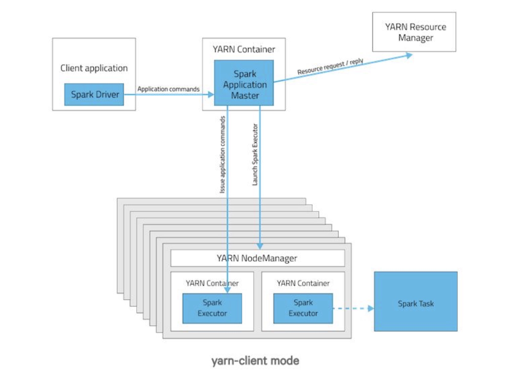
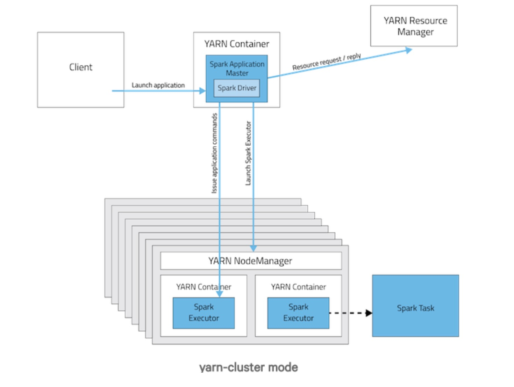

* `Yarn-cluster`  和 `Yarn-client` 区别

> * `SparkContext` 初始化不同，这也导致了 `Driver` 所在的位置不同，`Yarn-cluster` 的 `Driver` 是在集群的某一台 `NodeManager` 上，但是 `Yarn-client` 是在 `Driver` 所在的机器上
> * `Driver` 会和 `Executors` 进行通信，这也导致了 `Yarn-cluster` 在提交app之后可以关闭客户端，而 `Yarn-client` 不可以
> * `Yarn-cluster` 适合用于生产环境，`Yarn-client` 适合交互调试

⚠️ `spark-shell/spark-sql` 只支持 `Yarn-client` 模式，`spark-submit` 支持两种模式

* Spark on Yarn-client 架构图

* Spark on Yarn-cluster 架构图

* 两者启动进程分别有哪些？各自的作用？  

  参考：https://blog.csdn.net/huojiao2006/article/details/80563112

  > `spark on yarn-client` 进程  
  [hadoop@hadoop000 ~]$ jps  
  23810 CoarseGrainedExecutorBackend       创建维护Executor对象  
  23749 ExecutorLauncher  
  23786 CoarseGrainedExecutorBackend  
  23631 SparkSubmit  

  > `spark on yarn-cluster` 进程  
  > [hadoop@hadoop000 ~]$ jps  
  > 24241 CoarseGrainedExecutorBackend  
  > 24136 ApplicationMaster  
  > 24216 CoarseGrainedExecutorBackend  
  > 24026 SparkSubmit  