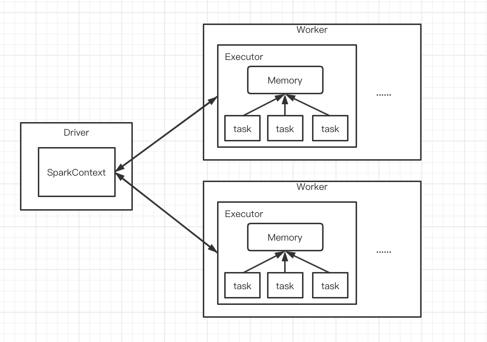

### 1.概述

Spark 应用程序执行时，会启动 Driver 和 Executor 两种 JVM 进程，前者主要负责创建 Spark 上下文，提交 Spark 作业(job)，并将作业转化为单个计算任务(task)，协调各个 Executor 进程间的任务调度；后者负责在工作节点上执行具体的计算任务(task)，为需要持久化的 RDD 提供存储功能，并将最终结果返回给 Driver。




### 2.静态内存管理

*StaticMemoryManager* 

#### 2.1.堆内内存(On-heap)

spark1.6之前默认的内存管理，在 Spark 应用程序运行期间存储内存(storage)、执行内存(executor)和其他内存大小都是固定不变的，不过这些值可以在启动前进行配置


如上图，静态内存管理中的各内存占比情况，涉及源码如下：

`org.apache.spark.memory.StaticMemoryManager`

```scala
/*
 * Max number of bytes worth of blocks to evict when unrolling
 * 用于 unroll 内存 0.6 * 0.9 * 0.2
 */
private val maxUnrollMemory: Long = {
  (maxStorageMemory * conf.getDouble("spark.storage.unrollFraction", 0.2)).toLong
}

/**
 * Return the total amount of memory available for the storage region, in bytes.
 * 存储内存 0.6 * 0.9
 * 由此推算出存储内存中的预留内存为  0.6 * (1-0.9)
 */
private def getMaxStorageMemory(conf: SparkConf): Long = {
  val systemMaxMemory = conf.getLong("spark.testing.memory", Runtime.getRuntime.maxMemory)
  val memoryFraction = conf.getDouble("spark.storage.memoryFraction", 0.6)
  val safetyFraction = conf.getDouble("spark.storage.safetyFraction", 0.9)
  // 内存计算公式
  (systemMaxMemory * memoryFraction * safetyFraction).toLong
}

/**
 * Return the total amount of memory available for the execution region, in bytes.
 * 执行内存 0.2 * 0.8
 * 由此推算出执行内存中的预留内存为  0.2 * (1-0.8)
 */
private def getMaxExecutionMemory(conf: SparkConf): Long = {
  val systemMaxMemory = conf.getLong("spark.testing.memory", Runtime.getRuntime.maxMemory)
  val memoryFraction = conf.getDouble("spark.shuffle.memoryFraction", 0.2)
  val safetyFraction = conf.getDouble("spark.shuffle.safetyFraction", 0.8)
  // 内存计算公式
  (systemMaxMemory * memoryFraction * safetyFraction).toLong
}
```

静态内存最大的特点就是，存储内存与执行内存之间被清晰地分隔开，即使己方内存不够使用也不能相互借用对方未使用的内存

其中 systemMaxMemory 取决于当前 JVM 堆内内存的大小

由于静态内存管理目前已经很少被使用，也就不进一步进行研究

#### 2.2.堆外内存(Off-heap)

对于堆外内存分配就较为简单了，只有存储和执行内存，可以使用参数 `spark.memory.storageFraction` 决定

堆外内存占用的空间可以被精准计算，所以无需设定保险区域

### 3.统一内存管理

*UnifiedMemoryManager*

#### 3.1.堆内内存(On-heap)

Spark1.6之后的版本引入了统一内存管理，该内存管理与静态内存管理的最大区别就是存储和执行内存可以共享同一块内存空间，动态占用对方的空闲内存区域，以达到内存的高效利用


如上图，统一内存管理各内存占比情况，executor 端的堆内内存区域大致可分为以下四块：

1. Execution：主要用于存放shuffle、join、sort、aggregation 等计算过程中的临时数据
2. Storage：用于存储 spark 的 cache 数据，例如 RDD 的缓存、unroll数据
3. 用户内存(User Memory)：用于存储 RDD 转换操作所需要的数据，例如 RDD 依赖等信息
4. 预留内存(Reserved Memory)：系统预留内存，用来存储 spark 内部对象

可参考源码如下：

`org.apache.spark.memory.UnifiedMemoryManager`  源码为spark1.6

```scala
// Set aside a fixed amount of memory for non-storage, non-execution purposes.
// This serves a function similar to `spark.memory.fraction`, but guarantees that we reserve
// sufficient memory for the system even for small heaps. E.g. if we have a 1GB JVM, then
// the memory used for execution and storage will be (1024 - 300) * 0.75 = 543MB by default.
// 预留系统内存 默认为 300MB
private val RESERVED_SYSTEM_MEMORY_BYTES = 300 * 1024 * 1024

def apply(conf: SparkConf, numCores: Int): UnifiedMemoryManager = {
  // 获取storage + execution内存
  val maxMemory = getMaxMemory(conf)
  new UnifiedMemoryManager(
    conf,
    maxMemory = maxMemory,
    // storage 占总的 50%（默认值）   剩余的就是 execution 执行内存
    storageRegionSize =
      (maxMemory * conf.getDouble("spark.memory.storageFraction", 0.5)).toLong,
    numCores = numCores)
}

/**
 * Return the total amount of memory shared between execution and storage, in bytes.
 */
private def getMaxMemory(conf: SparkConf): Long = {
  // 通过参数 spark.executor.memory 或者 --executor-memory 配置
  val systemMemory = conf.getLong("spark.testing.memory", Runtime.getRuntime.maxMemory)
  // spark2.2.1中写死的 不能修改 不过可以在测试环境下通过参数 spark.testing.reservedMemory 修改
  val reservedMemory = conf.getLong("spark.testing.reservedMemory",
    if (conf.contains("spark.testing")) 0 else RESERVED_SYSTEM_MEMORY_BYTES)
  val minSystemMemory = reservedMemory * 1.5
  if (systemMemory < minSystemMemory) {
    throw new IllegalArgumentException(s"System memory $systemMemory must " +
      s"be at least $minSystemMemory. Please use a larger heap size.")
  }
  // 可用内存 = 系统内存 - 预留内存
  val usableMemory = systemMemory - reservedMemory
  // storage 和 execution 内存总和参数 默认为 0.75(spark1.6)   0.6(spark2.+)
  val memoryFraction = conf.getDouble("spark.memory.fraction", 0.75)
  // storage + execution = usableMemory * 0.75
  (usableMemory * memoryFraction).toLong
}
```

#### 3.2.堆外内存(Off-heap)

堆外内存相较于堆内内存除了没有 other 空间，堆外内存和堆内内存的划分方式相同，所有运行中的并发任务共享存储和执行内存

该模式不在 JVM 内申请内存，所以不经过 JVM 内存管理，可以避免频繁的 GC

**堆外内存启用与大小设置**

1. Driver：`spark.yarn.driver.memoryOverhead`
2. Executor：`spark.yarn.executor.memoryOverhead`

参考源码：

`org.apache.spark.deploy.yarn.YarnSparkHadoopUtil`

`org.apache.spark.deploy.yarn.YarnAllocator` 

```scala
// Additional memory overhead
// 10% was arrived at experimentally. In the interest of minimizing memory waste while covering
// the common cases. Memory overhead tends to grow with container size.
val MEMORY_OVERHEAD_FACTOR = 0.10
val MEMORY_OVERHEAD_MIN = 384


// Executor memory in MB.
protected val executorMemory = args.executorMemory
// Additional memory overhead.
// 优先取通过参数 spark.yarn.executor.memoryOverhead 设置的
// 否则取 executorMemory * 0.1 与 384 的最大值  也就是最小为384MB 
protected val memoryOverhead: Int = sparkConf.getInt("spark.yarn.executor.memoryOverhead",
  math.max((MEMORY_OVERHEAD_FACTOR * executorMemory).toInt, MEMORY_OVERHEAD_MIN))
// Number of cores per executor.
protected val executorCores = args.executorCores
// Resource capability requested for each executors
// 最终内存大小为 executorMemory + memoryOverhead
private[yarn] val resource = Resource.newInstance(executorMemory + memoryOverhead, executorCores)
```

启用堆外内存之后，Executor 内将同时存在堆内和堆外内存，两者互不影响，此时 Executor 中的 Execution 内存是堆内 Execution 内存和堆外 Execution 内存之和，Storage 同理

#### 3.3.动态占用机制

该机制是统一内存管理的特性，不存在与静态内存管理

Execution 和 Storage 之间动态占用，也就是说 Execution 和 Storage 的内存是共享的，如果 Storage 内存不足，而 Execution 内存有空先，那么 Storage 就可以从 Execution 中申请内存，反之亦然

该机制流程如下：


具体实现逻辑如上图所示：

1. 程序提交时，会设定基本的 Execution 内存和 Storage 内存区域(`spark.memory.storageFraction`)
2. 程序运行是，当双方空间都不足时，则存储到硬盘，按照LRU规则将内存中的快存储到磁盘中；若己方空间不足而对方空间有剩余是，可借用对方空间（不足是指不足以放下一个完整的 Block）
3. Execution 内存的空间被对方占用后，可让对方将占用的部分转存到硬盘，然后"归还"借用的空间
4. Storage 内存的空间被对方占用后，目前的实现是无法让对方"归还"，因为需要考虑 Shuffle 过程中的很多因素，实现起来较为复杂；而且 Shuffle 过程产生的文件在后面一定会被使用到，而 Cache 在内存的数据不一定在后面使用

**以上借用只存在于同是堆内或者同是堆外的情况**

### 4.Task 内存分布

为了更好的使用内存，Executor 内运行的 Task 之间共享着 Execution 内存

具体分布情况下如下：

1. Spark 内部维护了一个 HashMap 用于记录每个 Task 占用的内存，当 Task 需要在 Execution 内存区域申请 numBytes 内存，其先判断 HashMap 里面是否维护该 Task 的内存使用情况，如果没有，则将该 Task 内存使用置为0，并且以 TaskId 为 key，内存使用大小(0)为 value 加入到 HashMap 里面
2. 为该 Task 申请 numBytes 内存，如果 Execution 内存区域正好有大于该 Task 要申请的空闲内存，则在 HashMap 里面将当前 Task 使用的内存加上 numBytes，然后返回；如果当前没有足够的空闲内存供申请，则当前 Task 被阻塞，直到其他 Task 释放足够的执行内存
3. 每个 Task 可用执行内存范围是 (1/2~1) n，其中 n 为当前执行内存中**正在运行**的 Task 数，所以一个 Task 能够申请到的最小内存为 1/2n * 执行内存大小；当 n=1 时，Task 可以使用全部执行内存

**源码分析**

`org.apache.spark.memory.ExecutionMemoryPool`

```scala
/**
 * Map from taskAttemptId -> memory consumption in bytes
 * 存放taskId 以及对应的使用到的内存大小
 */
@GuardedBy("lock")
private val memoryForTask = new mutable.HashMap[Long, Long]()

private[memory] def acquireMemory(numBytes: Long,taskAttemptId: Long,
    maybeGrowPool: Long => Unit = (additionalSpaceNeeded: Long) => Unit,
    computeMaxPoolSize: () => Long = () => poolSize): Long = lock.synchronized {
  assert(numBytes > 0, s"invalid number of bytes requested: $numBytes")

  // 判断map中是否含有该taskId
  if (!memoryForTask.contains(taskAttemptId)) {
    // 不包含 直接放入map中 taskId作为key   0作为使用的内存大小
    memoryForTask(taskAttemptId) = 0L
    // 唤醒
    lock.notifyAll()
  }

  // Keep looping until we're either sure that we don't want to grant this request (because this
  // task would have more than 1 / numActiveTasks of the memory) or we have enough free
  // memory to give it (we always let each task get at least 1 / (2 * numActiveTasks)).
  // TODO: simplify this to limit each task to its own slot
  while (true) {
    // 获取当前map中正在运行 task 数量
    val numActiveTasks = memoryForTask.keys.size
    // 获取档期 taskId 对应的内存大小
    val curMem = memoryForTask(taskAttemptId)

    // 从存储内存中开拓执行内存
    maybeGrowPool(numBytes - memoryFree)

    // 开拓执行内存之后最大的执行内存池大小
    val maxPoolSize = computeMaxPoolSize()
    // 基于正在运行的task 计算每个task最大的内存 1/n * 执行内存
    val maxMemoryPerTask = maxPoolSize / numActiveTasks
    // 基于正在运行的task 计算每个task最小的内存 1/2n * 执行内存
    val minMemoryPerTask = poolSize / (2 * numActiveTasks)

    // How much we can grant this task; keep its share within 0 <= X <= 1 / numActiveTasks
    // 授予该task的最大执行内存大小
    val maxToGrant = math.min(numBytes, math.max(0, maxMemoryPerTask - curMem))
    // Only give it as much memory as is free, which might be none if it reached 1 / numTasks
    // 申请到的内存大小
    val toGrant = math.min(maxToGrant, memoryFree)

    // We want to let each task get at least 1 / (2 * numActiveTasks) before blocking;
    // if we can't give it this much now, wait for other tasks to free up memory
    // (this happens if older tasks allocated lots of memory before N grew)
    // 判断当前是否可以授予该task 最小内存 (1/2*numActiveTasks) * 执行内存大小
    // 如果内存不足 就会等待其他任务去释放内存， 直到有足够内存为止
    if (toGrant < numBytes && curMem + toGrant < minMemoryPerTask) {
      logInfo(s"TID $taskAttemptId waiting for at least 1/2N of $poolName pool to be free")
      // 等待
      lock.wait()
    } else {
      memoryForTask(taskAttemptId) += toGrant
      return toGrant
    }
  }
  0L  // Never reached  从不会执行到该步
}
```

