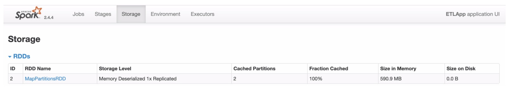
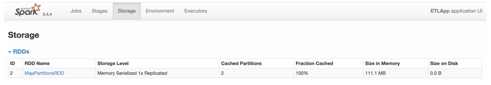
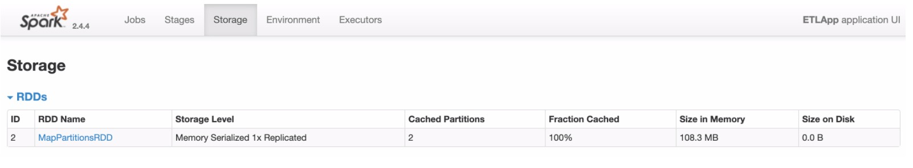
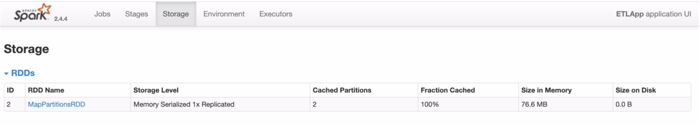

# 测试数据大小

```shell
[hadoop@hadoop000 logs]$ ls -lh
总用量 150M
-rw-r--r--. 1 root root 150M 10月 22 00:29 access.log
```

# 四种场景测试

* `rdd.persist(StorageLevel.MEMORY_ONLY)`



缓存占存储空间为 590.9MB ，接近原始数据大小的4倍（具体倍数不好说，但是起码2倍以上）

* `rdd.persist(StorageLevel.MEMORY_ONLY_SER)`



缓存占存储空间为 111.1MB，远远小于 `MEMORY_ONLY` ，且比原始数据小

* `rdd.persist(StorageLevel.MEMORY_ONLY_SER)`

```scala
val sparkConf = new SparkConf()
sparkConf.set("spark.serializer","org.apache.spark.serializer.KryoSerializer")
// 注意 此处只是设置了 没有 register
```



缓存占存储空间为 108.3MB，此种情况跟单单使用 ``rdd.persist(StorageLevel.MEMORY_ONLY_SER` ，效果差不多

* `rdd.persist(StorageLevel.MEMORY_ONLY_SER`

```scala
val sparkConf = new SparkConf()
sparkConf.set("spark.serializer","org.apache.spark.serializer.KryoSerializer")
// AccessLog implements Serializable
sparkConf.registerKryoClasses(Array(classOf[AccessLog]))
```



缓存占存储空间为 76.6MB，此种情况节省的存储空间就很可观了